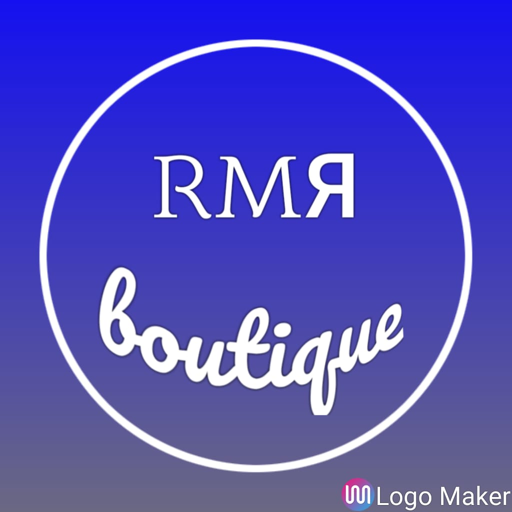

# 👚 ЯMR *Boutique*

# 🗂 Primer sprint (entrega 17/8)

## Integrantes

### 👖  Cano, Ramiro
  - 19 años
  - Técnico electrónico

### 👖 Almirón, Martin
  - 22 años
  - Vendedor

### 👗 Melián, Rocío
  - 22 años
  - Ama de casa

## 👀 Temática del sitio y audiencia
 El sitio ЯMR (Ramiro, Martin, Rocio) Boutique, como su nombre lo implica comercializara ropa de niños y adultos mediante un carrito de compras, teniendo como beneficio para su administrador poder agregar productos desde el sitio.

 La audiencia esperada es toda aquella que quiera comprar ropa desde la comodidad de su hogar ♥

 ## 📋 Listado de 5 páginas referentes

 - [Nike](https://www.nike.com/ar/)
    - Sistema de rutas en las imagenes
 - [Falabella](https://www.falabella.com/falabella-cl/)
    - Menú desplegable e información
 - [Adidas](https://www.adidas.com.ar/)
    - Register
    - Login
 - [Mimo&co](https://www.mimo.com.ar/)
    - Como esta formada la pagina en general
    - Sector de las imagenes en el home
 - [Steam](https://store.steampowered.com/)
    - Carrito de compras

 ## 📝 Wireframes
 - [Home](https://github.com/RocioMelian/Grupo_11_RMRBoutique/blob/master/sprint1/wireframes/home.jpg)
 - [Detalle del producto](https://github.com/RocioMelian/Grupo_11_RMRBoutique/blob/master/sprint1/wireframes/detalle-producto.png)
 - [Carrito de compras](https://github.com/RocioMelian/Grupo_11_RMRBoutique/blob/master/sprint1/wireframes/carrito.png)
 - [Formulario de registro](https://github.com/RocioMelian/Grupo_11_RMRBoutique/blob/master/sprint1/wireframes/register.png)
 - [Formulario de carga de producto](https://github.com/RocioMelian/Grupo_11_RMRBoutique/blob/master/sprint1/wireframes/form-admin.png)
 - [Inicio de sesión](https://github.com/RocioMelian/Grupo_11_RMRBoutique/blob/master/sprint1/wireframes/login.png)

## 🖌 Diseño(en proceso)
- [Logo](https://github.com/RocioMelian/Grupo_11_RMRBoutique/blob/master/sitio/public/images/logotipo2.png)
- [Fondo](https://github.com/RocioMelian/Grupo_11_RMRBoutique/blob/master/sitio/public/images/fondoo.jpg)
- [Colores](https://github.com/RocioMelian/Grupo_11_RMRBoutique/tree/master/sprint1/paletaColores)
- Tipografias
   - [Anton](https://fonts.google.com/specimen/Anton?query=anton)
   - [Allan](https://fonts.google.com/specimen/Allan?query=allan)
   - [Calibri](https://fonts.google.com/?query=calibri)
   - [Ubuntu](https://fonts.google.com/specimen/Ubuntu?query=ubuntu)
   - [Billabong](https://fonts.google.com/?query=billabong)

# 🗂 Segundo sprint (Entrega 7/9)

- 📑 [Tablero de trabajo](https://trello.com/b/uB2due9N/grupo-11-%D1%8Fmr-boutique)
- ⭐ [Retrospectiva](https://github.com/RocioMelian/Grupo_11_RMRBoutique/blob/master/retro.md)

#### 📄 Vistas (views)
  - HOME: home.ejs
  - DETALLE PRODUCTO: detalle.ejs
  - CARRITO DE COMPRAS: carrito.ejs
  - CARGA DE PRODUCTOS: carga.ejs
  - REGISTRO DE USUARIOS: register.ejs

# 🗂 Tercer sprint (Entrega 21/9)

  - 📑 [Tablero de trabajo](https://trello.com/b/uB2due9N/grupo-11-%D1%8Fmr-boutique)
  - ⭐ [Retrospectiva](https://github.com/RocioMelian/Grupo_11_RMRBoutique/blob/master/retro.md)
  - 🔉 [Daily](https://github.com/RocioMelian/Grupo_11_RMRBoutique/blob/master/daily.md)

### 📜 Aplicación Node + Express + EJS
  - Home /
  - Busqueda /products/search
  - Listado de productos /products
  - Detalle del producto /products/detalle/:id
  - Formulario de carga y edición de productos /products/carga & /products/editarProd/:id
  - Formulario de registro y login /users/register & /users/login

  # 🗂 Cuarto sprint (Entrega 5/10)

  - 📑 [Tablero de trabajo](https://trello.com/b/uB2due9N/grupo-11-%D1%8Fmr-boutique)
  - ⭐ [Retrospectiva](https://github.com/RocioMelian/Grupo_11_RMRBoutique/blob/master/retro.md)
  - 🔉 [Daily](https://github.com/RocioMelian/Grupo_11_RMRBoutique/blob/master/daily.md)

  ### 👤 Registro de usuarios
  -  Accesible desde /users/register o desde el header, ingresando al login y luego a "¿No tienes cuenta?", permite al usuario registrarse completando los datos, se verican que los mismos sean correctos y en caso de no serlo devuelve los errores debajo de cada campo del formulario, permite subir un avatar de perfil (si el usuario no lo hace se le asigna una por defecto), la contraseña es encriptada antes de guardarse en en JSON de usuarios.

### 🌂 Login de usuarios
   - Accesible desde /users/login o desde el header. Se verifica la información enviada por el usuario y en caso de haber un error lo devuelve debajo del input donde se produjo, en caso de login correcto, se redirije al home.
   - Función de recordar .

### 🚦 Rutas de huéspedes y de usuarios
  - Los huéspedes pueden, por el momento sólo acceder al home y al login/registro, cualquier otra acción los redirige al login

  - Los usuarios logueados pueden acceder al detalle de los productos, y al carrito pero en el detalle del producto no le aparecen los iconos editar y eliminar producto.
    - Email: matu.memg@gmail.com
    - Password:123456

  - Los usuarios logueados como administrador pueden acceder a todo lo anterior + formulario de agregar producto y en el detalle del producto les aparecen los iconos de editar y eliminar producto. 
    - Email: ramiro2000z.rc@gmail.com 
    - Password:123456

    # 🗂 Quinto sprint (Entrega 5/11) 
  - 📑 [Tablero de trabajo](https://trello.com/b/uB2due9N/grupo-11-%D1%8Fmr-boutique)
  - ⭐ [Retrospectiva](https://github.com/RocioMelian/Grupo_11_RMRBoutique/blob/master/retro.md)
  - 🔉 [Daily](https://github.com/RocioMelian/Grupo_11_RMRBoutique/blob/master/daily.md)

  - 💡 [Script de creación de DB](https://github.com/RocioMelian/Grupo_11_RMRBoutique/blob/master/structure.sql)

  - 🎁 [Script de población de DB](https://github.com/RocioMelian/Grupo_11_RMRBoutique/blob/master/rmrboutique.sql)

  - 📄 [Diagrama de DB en PDF](https://github.com/RocioMelian/Grupo_11_RMRBoutique/blob/master/diagrampdf.pdf)

